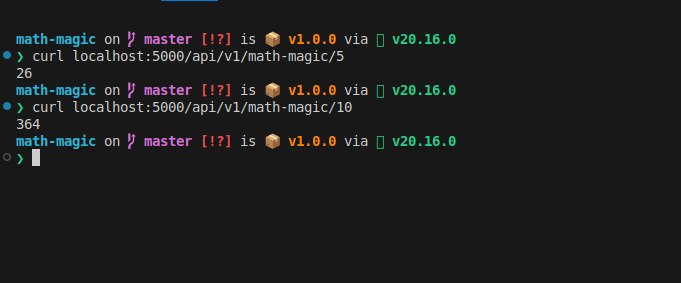

## Math-Magic

Below are the instructions to run this repo

- Install Dependencies
  - ```powershell
    pnpm install
    ```
- Run app

  - ```powershell
    pnpm run dev
    ```

- Hit API
  - ```powershell
    curl localhost:5000/api/v1/math-magic/5
    ```


